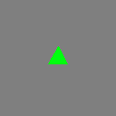
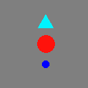
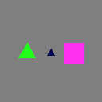
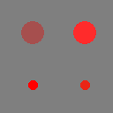
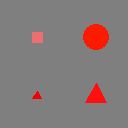
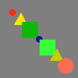
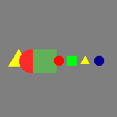

# KANDY benchmark and hierarchical Kandinsky pattern generator
## Description

This library contains the generator and datasets for the [KANDY benchmark](https://arxiv.org/abs/2402.17431).

Datasets are available in the [release section](../../releases/latest/).
Baseline experiments described in the paper are available in the `baseline` subfolder.

[](https://creativecommons.org/licenses/by-nc-sa/4.0/)

## Introduction

Humans can learn effortlessly new concepts from limited examples, on the other hand neural networks struggle when presented with limited examples and when they are required to compose previously acquired knowledge into new concepts.
We argue that one of the reasons of these limitations is the radically different learning regimes to which humans and neural networks are subject to.

Human education is heavily reliant on teachers "scheduling" concept difficulties in a way which elicits correct chains of thoughts and associations, and capable of presenting "old concepts" whenever they are deemed useful for the current task.
Moreover, as the student gets more confident with its answers, a teacher gradually reduces supervision, promoting a more independent decision making process.

This code presents samples from a sequence of tasks in a non i.i.d. fashion, by emulating a teacher's behavior on a sequence of binary classification tasks.
Each task is identified by two sets of hierarchical symbolic rules defined on a simple geometric domain and the student is provided with an image, with the objective of determining whether the input belongs to the positive or negative set.
The teacher presents samples from each task sequentially and, inside each task, it can decide to provide samples either with or without supervision, according to a decayed schedule.

The schedule is governed by an exponential distribution providing maximum supervision at the beginning of each task and minimum at the end.
This schedule emulates, for example, the behavior of a math teacher presenting topics from counting to differential equations, sorted in the way eliciting the best learning response.

The code provides a way to define curricula in YAML format and a generator which can be queried both for traditional datasets (for i.i.d. training or testing) and tutored samples generated one at the time.
Optionally, noise can be injected in task identifiers to verify whether the learner relies onto them or not.

## KANDY datasets

We release two benchmarks in the form of curricula of tasks,
that showcase the features available to the end-user. We name the two curricula Easy
and Hard, due to the different complexity of the involved tasks. In both curricula, each
sample is a $224 \times 224$ RGB image annotated with: task id, binary label, supervision
state (whether the label should be used in training), and symbolic representation. The
symbolic structure is a recursive dictionary of lists representing a tree, where keys
are nodes annotated with compositional operators and values are children. Leaves are
dictionaries in the form `{shape: SH, color: CO, size: SZ}`, and they represent
atomic objects. No list expansion operator appears in symbolic annotations. Atomic
objects can be small or large ($10 \times 10$ and $25 \times 25$ pixels, respectively), and they can
take any of six colors (red, green, blue, cyan, magenta and yellow). Object sizes are
corrupted by additive uniform noise in the range $\pm[0, 2]$ pixels, and color is corrupted
by zero-mean Gaussian noise in HSV coordinates ($\sigma_H = 0.01, \sigma_S = 0.2, \sigma_V = 0.2$).
No rotational noise is injected in any task. 
These values were hand-picked to preserve perceptual boundaries (e.g., humans still
perceive the maximally corrupted “red” as such). Background was set to gray.

## Kandinsky pattern generator

Each task image contains base concepts (configurable, in the KANDY benchmark they are: triangles, squares and circles, in 6 different colors and 2 different sizes), which can be composed spatially by the following recursive operators:
- `in`: subconcepts are drawn one inside the other
- `quadrant_ul`: subconcepts are drawn one inside the other in the upper left quadrant
- `quadrant_ur`: subconcepts are drawn one inside the other in the upper right quadrant
- `quadrant_ll`: subconcepts are drawn one inside the other in the lower left quadrant
- `quadrant_lr`: subconcepts are drawn one inside the other in the lower right quadrant
- `random`: subconcepts are drawn at random positions
- `stack`: subconcepts are drawn top-to-bottom, the horizontal dimension of the bounding box is the same as the parent
- `stack_reduce_bb`: subconcepts are drawn top-to-bottom, the horizontal dimension of the bounding box is reduced to match the vertical one
- `side_by_side`: subconcepts are drawn left-to-right, the vertical dimension of the bounding box is the same as the parent
- `side_by_side_reduce_bb`: subconcepts are drawn left-to-right, the vertical dimension of the bounding box is reduced to match the horizontal one
- `diag_ul_lr`: subconcepts are drawn diagonally, from the upper left corner to the lower right
- `diag_ll_ur`: subconcepts are drawn diagonally, from the lower left corner to the upper right
- `grid`: subconcepts are arranged in a square grid, left-to-right, top-to-bottom

Spatial compositions can be arbitrarily complex, however, as the available space for each level decreases exponentially, there is a practical limit after which images get overcrowded.
This can be counteracted only in part by using larger canvas sizes.

Atomic concepts can be specified by their properties, e.g.: `{"shape": triangle, "color": red, size: small}`
The following shorthand notations are available to avoid specifying combinations of properties exhaustively:
- `~`: any value, e.g. `"size": ~` is either of small or large
- `not_X`: anything except X, e.g. `shape: not_square` is either a triangle or a circle
- `A|B|...|K`: disjunction, e.g. `color: red|green|blue` is any of red, green or blue.

- Set operators `union(L), intersection(L), difference(L), symmetric_difference(L)`: they are replaced by the associative unfolding of the list with respect to the operator (the list must contain only atomic objects).
They can be used to constrain grounding (especially when used in conjunction with `store_before` and `recall` operators).
- Constraint operators `ground_together(L, props), random_ground_together(L, props), subset_ground_together(L, props), random_subset_ground_together(L, props)`: grounds `~` in the subtree by selecting the same value for the provided properties (e.g. a triangle and a square of the same color). Random variants may decide not to constrain values, subset variants will select a random subset of properties (e.g. `{color: red|yellow, size: not_large}` for some instances will fix the same color and the same size, while respecting the constraints, the same color or the same size; combined with random there is also a chance of not fixing any value).

Top level concepts are implicitly disjunctive, allowing for complex tasks such as discriminating between "three red circles arranged diagonally, or three blue squares arranged vertically" (positive set) versus "three blue squares arranged diagonally, or three red circles arranged vertically" (negative set).

A positive/negative set is a list of top level objects. As syntactic sugar, to simplify specification of tasks, the following list manipulation operators are defined:
- `sample(n, L)`: randomly sample n elements from list L with repetition
- `pick(n, L)`: randomly sample n elements from list L without repetition
- `first(n, L)`: return first n elements from list L
- `last(n, L)`: return last n elements from list L
- `shift(n, L)`: barrel shift list L by n to the right (left if n < 0), eg. `shift(2, [triangle, square, circle, circle, square]) -> [circle, square, triangle, square, circle]`
- `repeat(n, L)`: repeat list L n times
- `random_repeat(min, max, L)`: select a random integer between min and max (included) and repeat list L that amount of times
- `random_sample(min, max, L)`: randomly sample n (chosen between min and max) elements from list L with repetition
- `random_pick(min, max, L)`: randomly sample n (chosen between min and max) elements from list L without repetition
- `permute(L)`: return a random permutation of list L
- `mirror(L)`: append a mirrored list to L, eg. `mirror([triangle, square, circle]) -> [triangle, square, circle, circle, square, triangle]`
- `palindrome(L)`: append a mirrored list to L excluding the last element which acts as pivot, eg. `palindrome([triangle, square, circle]) -> [triangle, square, circle, square, triangle]`
- `sort(order, keys, L)`: sort list L in `asc`ending/`desc`ending order, according to keys
- `argsort(idx, L)`: manually sorts L according to indices (in 0..len(L) - 1)
- `store(alias, obj)`: memorizes obj (any between a list, an atomic or compound object) for later retrieval
- `recall(alias)`: it is replaced by the previously memorized object associated with that alias
- `any_composition(L)`: it is replaced by a random compositional operator
- `any_displacement(L)`: it is replaced by a random non-overlapping compositional operator (`stack, side_by_side, diag_ul_lr, diag_ll_ur, grid`)
- `any_line(L)`: it is replaced by a random line compositional operator (`stack, side_by_side, diag_ul_lr, diag_ll_ur`)
- `any_quadrant(L)`: it is replaced by a random quadrant compositional operator (`quadrant_ul, quadrant_ur, quadrant_ll, quadrant_lr`)
- `quadrant_or_center(L)`: it is replaced by a random in-like compositional operator (`in, quadrant_ul, quadrant_ur, quadrant_ll, quadrant_lr`)

Sorting keys are:
- `n`: element cardinality (1 for atomic elements, len(L) for compound elements)
- `shape`: shapes, in the order defined in config.yml (ideally by number of vertexes)
- `color`: color, in the order defined in config.yml
- `size`: size, in the order defined in config.yml, which may not reflect pixel size
If the list contains one or more compound objects, the only valid sorting key is `n`, otherwise keys are evaluated in order (e.g., `[color, size]` first sorts by color and within objects of the same color it sorts by size).

These operators are always applied **AFTER** grounding atomic objects, therefore `repeat(n: 3, list: [{shape: not_square, color: red, size: ~])` will be resolved in the following way:
1) Randomly ground attributes in atomic shapes, e.g. `{shape: circle, color: red, size: small}`
2) Apply the expansion operators: `[{shape: circle, color: red, size: small}, {shape: circle, color: red, size: small}, {shape: circle, color: red, size: small}]`.
In this example, the repetition produces three **identical** objects.

In case this behavior is not desired, the following variants of list operators perform expansion **BEFORE** grounding:
- `sample_before(n, L)`
- `pick_before(n, L)`
- `first_before(n, L)`
- `last_before(n, L)`
- `shift_before(n, L)`
- `repeat_before(n, L)`
- `random_repeat_before(min, max, L)`
- `random_sample_before(min, max, L)`
- `random_pick_before(min, max, L)`
- `permute_before(L)`
- `mirror_before(L)`
- `palindrome_before(L)`
- `store_before(alias, L)`.

Other operators are either equivariant with respect to grounding or are semantically ill-defined (e.g. sorting a list before knowing how it will be grounded) and they do not possess a `_before` variant. 

An example which uses both before- and after-grounding list expansions is the following:
```commandline
side_by_side:
   - palindrome:
      - {shape: ~, color: ~, size: ~}
      - stack: 
        - repeat_before:
          n: 3
          list:
          - {shape: ~, color: ~, size: ~}
```

This structure is resolved in the following way:
1) Apply the before-grounding expansions:
```commandline
side_by_side:
  - palindrome:
    - {shape: ~, color: ~, size: ~}
    - stack:
      - {shape: ~, color: ~, size: ~}
      - {shape: ~, color: ~, size: ~}
      - {shape: ~, color: ~, size: ~}
```
2) Perform random grounding:
```commandline
side_by_side:
  - palindrome:
    - {shape: triangle, color: red, size: large}
    - stack:
      - {shape: square, color: yellow, size: small}
      - {shape: triangle, color: green, size: large}
      - {shape: circle, color: cyan, size: large}
```
3) Apply the after-grounding expansions:
```commandline
side_by_side:
  - {shape: triangle, color: red, size: large}
  - stack:
    - {shape: square, color: yellow, size: small}
    - {shape: triangle, color: green, size: large}
    - {shape: circle, color: cyan, size: large}
  - {shape: triangle, color: red, size: large}
```
Different variants of the same structure, like:
```commandline
side_by_side:
   - palindrome_before:
      - {shape: ~, color: ~, size: ~}
      - stack: 
        - repeat:
          n: 3
          list:
          - {shape: ~, color: ~, size: ~}
```
would have yielded:
```commandline
side_by_side:
  - {shape: triangle, color: red, size: large}
  - stack:
    - {shape: square, color: yellow, size: small}
    - {shape: square, color: yellow, size: small}
    - {shape: square, color: yellow, size: small}
  - {shape: square, color: cyan, size: large}
```

**Caveat**: Set operators are always applied **BEFORE** grounding. If they contain `recall` expansions, these are evaluated before grounding as well, this means they can **ONLY** recall aliases defined by a `store_before` operator.
Recall expansions outside set operators do not possess this limitation.

List manipulation operators and compositional operators can be arbitrarily composed in the YAML specification file. Additionally, YAML aliases (`& *`) and overrides (`<<`) are supported for shorthand definitions.

To maximize experimental robustness, three mechanisms are enforced:
- A random seed can be specified in the configuration file for the teacher. Each task will have a unique random generator with a seed computed from the teacher's and the task id.
- Rejection sampling is used to produce `samples` unique samples for each task. A patience hyperparameter determines the number of failed trials before giving up. If patience is not exhausted, samples are guaranteed to be unique and will be presented without repetition, otherwise, sampling with repetition will be performed.
- Optionally, a (set of) Prolog rule(s) can be defined for each task in the form `valid(X) :- ...`, an interpreter will load facts and rules from a background knowledge file (specified in `config.yml`) and check every generated sample. If a positive sample does not satisfy the rule(s), or a negative one satisfies it, the sample is rejected. Multiple task rules can be specified using YAML multiline strings.

The following is an example curriculum composed of two tasks:
```
- 
  name: my task # Name of the task. Spaces are fully supported, if you want to use KANDY for Bongard problems, you can use this field as a ground truth natural language description for the entire task.
  gamma: 0.9 # maximum supervision
  beta: 0.5 # minimum supervision
  samples: 5000 # number of samples
  train_split: 0.8 # training set split ratio. The training set has samples * train_split elements
  val_split: 0.1 # validation set split ratio. The test set is computed as (1.0 - train_split - val_split)
  noisy_color: True # Inject random noise to colors (while preserving semantic classes)?
  noisy_size: False # Inject random noise to sizes?
  rot_noise: 0 # Randomly rotate atomic shapes? Values in [0, 360]. Shapes in this task will not be randomly rotated
  positive_set: # Definition of the positive set for the task. It contains a list of possible samples.
  - stack: # Compositional operator: receives a list of subelements.
    - palindrome:
      - {shape: triangle|circle, color: ~, size: not_small} # Atomic object. ~/null indicates any value. a|b indicates a choice. not_a indicates a negation.
      - {shape: ~, color: red, size: large}
      #- {shape: square, color: ~, size: ~}
      - side_by_side:
        - sort:
            order: asc
            keys: [shape, color]
            list:
              - {shape: ~, color: red, size: small}
              - {shape: ~, color: green, size: small}
              - {shape: ~, color: blue, size: small}
        - {shape: circle, color: blue, size: large}
      - {shape: square, color: magenta, size: small}
      
  
  negative_set:
  - stack:
    - &my_green_object {shape: ~, color: green, size: ~} # Definition of an alias for an object used multiple times.
    - &my_red_object {shape: ~, color: red, size: ~}
    - &my_triangle {shape: triangle, color: ~, size: ~}
    - &my_small {shape: ~, color: ~, size: small}
  - grid:
    - random_repeat:
        min: 2
        max: 5
        list:
          - sample:
            n: 3
            list:
              - *my_green_object
              - *my_red_object
              - mirror:
                - *my_green_object
                - {shape: square, color: not_magenta, size: large}
                - *my_red_object
              - *my_triangle
              - *my_small
-
  name: yet another task
  gamma: 0.0 # This task is fully unsupervised
  beta: 0.0
  samples: 3
  train_split: 0.5
  val_split: 0.2
  noisy_color: False
  noisy_size: False
  rot_noise: 15 # In this case shapes will be rotated by a value between -15 and +15 degrees
  # This task has two (disjunctive) prolog rules for rejection sampling (and a predicate they depend on). It is assumed that predicates color/2 and contains/2 are defined in a .pl file linked in config.yml, otherwise the entire knowledge base could be specified here...
  positive_rule: >-
    is_green(X) :- color(X, green).
    valid(X) :- is_green(X).
    valid(X) :- contains(X, Y), is_green(Y).
    
  positive_set:
  - *my_green_object
  negative_set:
  - *my_red_object
```


All the tasks are assumed to be binary decision tasks determining whether an image belongs to a positive or negative set.

**Important**: if there are enough unique samples, distributions are balanced (0.5 positives, 0.5 negatives), otherwise, the ratio between positive and negative samples will reflect the internal distribution of symbols (i.e., a task specified with positive set consisting of 7 elements and a negative set consisting of 3 elements will approach a 0.7/0.3 positives-to-negatives ratio).

## Examples

| Task description                 | Positive example                       | Negative example                           |
|----------------------------------|----------------------------------------|--------------------------------------------|
| The image contains a triangle    |      |      |
| Objects are arranged vertically  |      |      |
| Shapes are all the same          |              |              |
| Shapes form a palindrome         |  |  |

## Requirements
```
yaml
logging
numpy
colorsys
pillow
pyswip >= 0.2.11
```

**Note**: The datasets are self-contained, and they require no library (see below).

## Generator usage

1. Write a YAML configuration (see the example `config.yml`).
2. Write a YAML curriculum (see `easy.yml` and `hard.yml`).
3. Create a teacher:
    ```python
   cg = CurriculumGenerator("config.yml", "curriculum.yml", logger=logger)
   # Logger is an optional instance of logging for debug purposes.
   ```
4. Use the teacher:
   - As task-incremental **supervised** dataset:
     ```python
     cg.reset()
     for i in range(len(cg.tasks)):
        for j in range(num_batches):
            for batch in cg.get_batch(i, batch_size, split):
                # batch is a list of tuples (sample_img, label, task_id, symbol)
                # label is 1 for positive and 0 for negative samples
                # split is "train"/"val"/"test".
                use(batch)
     ```
   - As task-incremental stream with decayed supervisions:
     ```python
     cg.reset()
     for i in range(len(cg.tasks)):
        for j in range(num_batches):
            for sample in cg.get_stream(i, split):
                (sample_img, label, supervised, task_id, symbol) = sample
                # label is 1 for positive, 0 for negative samples.
                # supervised is 1 for supervised samples, 0 for unsupervised ones.
                # split is "train"/"val"/"test".
                masked_label = label if supervised else None
                use(sample_img, masked_label, task_id, symbol)
     ```
   - As tutor generator:
    ```python
    for batch in cg.generate_curriculum(split, task_id_noise, batch_size):
        # task_id_noise is the probability of corrupting task_id labels
        # batch is a list of (sample_img, label, supervised, task_id, symbol) samples
        use(batch)
    ```
   - As i.i.d. shuffled tutor generator:
    ```python
    for batch in cg.generate_shuffled_curriculum(split, task_id_noise, batch_size):
        # task_id_noise is the probability of corrupting task_id labels
        # batch is a list of (sample_img, label, task_id, symbol) samples
        # Compared to generate_curriculum, task_ids are not sequential.
        use(batch)
    ```
   Note: Discard `task_id` for continual learning applications where it is unrealistic to know task progression.

## Datasets

The ready-to-use datasets described in the KANDY paper are available for download in the releases. They do not require this library, as they consist of `.png` images with annotations in separate `.csv` files.
Annotations include:
- `filename`: the path (relative to the csv file) of the image
- `task_id`: id of the task within the curriculum (noise injection is disabled for released datasets)
- `label`: 1 if the sample belongs to the positive set, 0 otherwise
- `supervised`: 1 if the label should be available to the learner, 0 if the label should only be used for evaluation of unsupervised learning
- `symbol`: a string describing the underlying structure of the sample. It should **NOT** be provided as supervision to the learner.

Additionally for reproducibility, dataset specifications (files `specs.txt`) and the config/curriculum files (`.yml` and `.pl`) are provided as well.

## How to use the datasets

### Traditional machine learning (batch mode)
1. Load annotation file from `samples/sets/{split}/annotations.csv`
2. Select task of interest by id (or perform multi-task learning)
3. Compute a "global" loss function by multiplexing a supervised loss (when `supervised == 1`) and an unsupervised loss (when `supervised == 0`).
   A straight-forward differentiable solution could be $supervised \cdot supervised\_loss(sample, label) + (1 - supervised) \cdot unsupervised\_loss(sample)$, but unless batch size is 1, more sophisticated approaches are required.
4. Evaluate predictions using the true label also when `supervised` was 0
5. Exploit `symbol` for method-specific explanations (e.g., attention masks matching the hierarchy?)

### Traditional machine learning (continual learning mode)
1.
   1. If you want to observe tasks in order, load annotation file from `samples/sets/{split}/annotations.csv`
   2. Otherwise, load annotation file from `samples/shuffled_curriculum/{split}/annotations.csv`
2. Compute a "global" loss function by multiplexing a supervised loss (when `supervised == 1`) and an unsupervised loss (when `supervised == 0`).
   A straight-forward differentiable solution could be $supervised \cdot supervised\_loss(sample, label) + (1 - supervised) \cdot unsupervised\_loss(sample)$, but unless batch size is 1, more sophisticated approaches are required.
3. Apply a catastrophic forgetting mitigation strategy (you are allowed to memorize samples in a replay buffer, but not allowed to go over the stream multiple times)
4. Evaluate predictions using the true label also when `supervised` was 0
5. Exploit `symbol` for method-specific explanations (e.g., attention masks matching the hierarchy?)

**Note**: Samples in the shuffled curriculum folder are contained in a pseudo-task folder `0`.

### Inductive reasoning
1. Load annotation file from `samples/sets/{split}/annotations.csv`. Images are not required.
2. Write your own encoding procedure of `symbol` strings
3. Write your own background knowledge (`bg.pl` in the main repository contains a minimal set of predicates which can be adapted to a different encoding), avoiding "cheat predicates" (i.e., **do not copy** the rules used at rejection in the `.yml` file)
4. If your ILP framework does not support predicate invention, or if it is too expensive, feel free to add helper predicates to your background knowledge
5. Manually evaluate induced predicates against rules in the `.yml` file (multiple correct predicates are possible and different encodings can produce radically different results).

Given the following symbol:
```
stack([
  diag_ul_lr([
    {"shape": "triangle", "color": "red", "size": "small"},
    {"shape": "square", "color": "red", "size": "small"},
    {"shape": "triangle", "color": "red", "size": "small"}
  ],
  {"shape": "circle", "color": "blue", "size": "large}
])
```
There can be multiple encodings, some examples include:
- "natural" encoding: the complex hierarchy is a compound term and atomic shapes are atoms. Each operator is a functor applied to a list. The symbol itself can be used as ILP example.
   ```
  positive_example(stack([diag_ul_lr([tr_red_sm, sq_red_sm, tr_red_sm]), ci_blu_lg])).
  ```
- "pointer" encoding: each level of the hierarchy is an atomic term, a predicate is used to link compositions in the background knowledge. The ILP example needs a separate specification.
  ```
  % In the background knowledge:
  defined_as(comp_0001, diag_ul_lr, [tr_red_sm, sq_red_sm, tr_red_sm]).
  defined_as(comp_0002, stack, [comp_0001, ci_blu_lg]).
  
  % In the examples file:
  positive_example(comp_0002).
  ```
- "cartesian" encoding: each object is encoded by its shape and its position (e.g., `is(obj0001, triangle, red, small), at_xy(obj0001, 30, 42`). We expect induction with this encoding to be extremely difficult as no compositional bias can be enforced at the representation level.

### Neuro-symbolic learning and reasoning
How to use the benchmark under neuro-symbolic frameworks heavily depends on their constraints and capabilities.
The main goals of this benchmark concerning neuro-symbolic settings are:
- Evaluate representation learning of arbitrary (recursive) structures
- Evaluate reasoning in compositional domains
- Encourage continual/curriculum techniques in the community, for the investigation of the stability-plasticity trade-off also in reasoning settings 
- Encourage investigation of the effects of label scarcity in complex domains.

In general, avoid supervision at the structure level (i.e., the `symbol` annotation **CANNOT** be used as supervision on the neural component), you should aim for an end-to-end supervision (only `label` annotation during training).
If unsupervised learning is not available for your framework, either use a $\gamma = \beta = 1.0$ dataset, or discard samples with `supervised == 0`.

Ideally, let the framework discover compositions with its neural component (i.e., avoid manually defining a feature extractor for vertically stacked objects, one for horizontally placed, etc.), as representation learning of arbitrarily complex hierarchies is a core feature of the benchmark.

We do not provide pretraining datasets, you are free to define them, as long as they still allow for fair evaluation of your method (i.e., they can be used to reduce training time, or the search space in reasoning, but they cannot be used to allow some form of memorization of tasks in the dataset).

You are encouraged to define additional tasks and/or modify the generator, for example to assess generalization of reasoning/representations to new tasks, higher-order capabilities, reasoning under noisy perception, etc.
